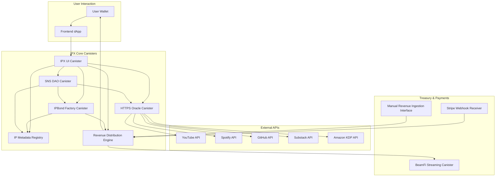

# IPX(Intellectual Property Exchange):Dynamic IP-Backed Bond Protocol

A decentralized protocol that lets creators, studios, or IP owners **mint bond-like tokens** representing future cashflows from their intellectual property (IP) such as:

* YouTube Ad revenue
* Spotify streams
* Substack subscriptions
* GitHub Sponsors
* Kindle eBooks
* Game revenue

These tokens can be sold to backers, investors, or fans effectively **raising capital against future performance**.

> Think of it as “Kickstarter meets DeFi Bonds for Creators”, but decentralized, automated, and governed by DAO.

---

## Problem Statement: IPX – On-Chain Financing for Digital Revenue Streams

Modern digital creators generate substantial recurring revenue across platforms like YouTube, Spotify, and Substack, but **lack direct access to decentralized capital markets**. While the revenue data is available through public APIs, there’s currently no protocol that can:

* **Trustlessly collateralize creator earnings**
* **Tokenize and fractionalize IP revenue streams as financial NFTs**
* **Programmatically route revenue through smart contract waterfalls**
* **Enable real-time payouts and investor liquidity**

At the same time, DeFi lacks high-quality, real-yield collateral sources beyond stablecoins and governance tokens. This creates an untapped opportunity for structured, yield-generating products backed by **provable, off-chain cashflows**.

> **IPX solves this by bridging off-chain creator revenues into on-chain structured finance instruments**, using HTTPS outcalls, Service Nervous System (SNS) DAOs, and revenue-distributing canisters on ICP.

We leverage:

*  **HTTPS outcalls** to fetch verified creator earnings (e.g., YouTube/Spotify analytics)
*  **Canister logic** to escrow and waterfall-distribute revenue
*  **ICRC-7 NFTs** to represent investor shares in each IP revenue stream
*  **SNS DAOs** to govern creator projects and approve early redemptions or buyouts
*  **End-to-end decentralization** enabled by Internet Computer’s boundaryless compute model

---

##  **How It Works (Workflow)**

1. **IP Owner Registers IP Asset**

   * Signs in via Internet Identity.
   * Adds metadata: YouTube Channel ID, Substack URL, GitHub Repo, etc.
   * Chooses what % of revenue to tokenize and term (e.g. 20% of next 12 months).

2. **Bond NFT Minting**

   * A **specialized NFT (ICRC-7)** is minted to represent the “right to future revenue”.
   * Backed by **verified performance** (via HTTPS outcalls).

3. **Token Sale**

   * The NFT (or fungible IP token) is sold in a **Sonic LBP** pool.

4. **Revenue Tracking via HTTPS Outcalls**

   * A canister pulls in metrics from:

     * YouTube (AdSense revenue via API)
     * Substack (subscriber count)
     * GitHub Sponsors API
     * Spotify monthly listeners
     * Amazon KDP sales
   * These metrics determine **performance-linked payouts**.

5. **Revenue Streaming (BeamFi Integration)**

   * As the revenue is earned, it is streamed to token holders based on their share.
   * Uses **BeamFi** and smart contract payout waterfall logic.

6. **Governance via SNS DAO**

   * Community votes on:

     * Whitelisting new IP types
     * Modifying oracle APIs
     * Auditing claims
     * Adjusting bond terms
   * DAO holds protocol fees.

---

