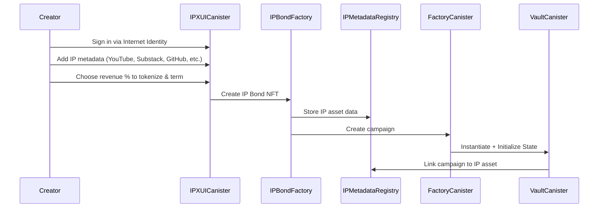
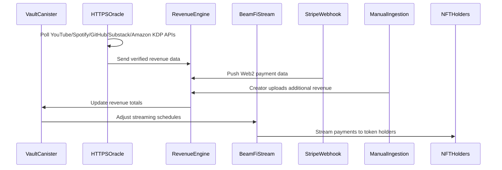

# IPX Protocol Documentation

## Table of Contents
1. [Overview](#overview)
2. [Enhanced Architecture](#enhanced-architecture)
3. [Protocol Mechanics](#protocol-mechanics)
4. [Canister Documentation](#canister-documentation)
5. [API Reference](#api-reference)
6. [Complete Usage Examples](#complete-usage-examples)
7. [Deployment Guide](#deployment-guide)
8. [Integration Guide](#integration-guide)

## Overview

IPX Protocol is a decentralized platform built on the Internet Computer (ICP) that enables creators to tokenize their intellectual property and future revenue streams through NFT-based investment campaigns. The protocol allows creators to raise funding by offering investors specialized IP Bonds (NFTs) that represent a share in their future earnings from platforms like YouTube, Spotify, GitHub, Substack, and Amazon KDP.

### Key Features

- **Intellectual Property Tokenization**: Creators tokenize future revenue streams from multiple platforms through dedicated IP Bond NFTs
- **Multi-Platform Revenue Tracking**: HTTPS outcalls to YouTube, Spotify, GitHub, Substack, Amazon KDP, and traditional payment processors
- **Performance-Linked Payouts**: Dynamic distributions based on actual performance metrics with bonus tiers
- **BeamFi Streaming Integration**: Time-locked payment schedules with real-time adjustments
- **SNS DAO Governance**: Decentralized governance for disputes, platform additions, and protocol decisions
- **Sonic LBP Integration**: Token distribution through Sonic Liquidity Bootstrapping Pools
- **Web2 Payment Integration**: Stripe webhook receiver for traditional revenue sources

## Enhanced Architecture

### Enhanced Modular Canister Architecture

The IPX Protocol implements a sophisticated modular architecture with multiple specialized canisters that work in concert to provide a complete decentralized intellectual property tokenization solution:

```
┌─────────────────────────────────────────────────────────────────────────────┐
│                         IPX Protocol Architecture                           │
├─────────────────────────────────────────────────────────────────────────────┤
│                                                                             │
│  ┌─────────────────┐    ┌─────────────────┐                                │
│  │ User Wallet     │────│ Frontend dApp   │                                │
│  │ (II/Plug)       │    │ (IPX UI)        │                                │
│  └─────────────────┘    └─────────────────┘                                │
│           │                       │                                        │
│           └───────────────────────┼────────────────────────────────────────│
│                                   ↓                                        │
│  ┌─────────────────────────────────────────────────────────────────────┐   │
│  │                    IPX Core Canisters                              │   │
│  │  ┌─────────────────┐  ┌─────────────────┐  ┌─────────────────┐    │   │
│  │  │ IPX UI Canister │  │ IPBond Factory  │  │ IP Metadata     │    │   │
│  │  │ • Frontend      │──│ • Bond NFT      │──│ Registry        │    │   │
│  │  │   Interface     │  │   Creation      │  │ • Asset Data    │    │   │
│  │  │ • User Auth     │  │ • Campaign Mgmt │  │ • Performance   │    │   │
│  │  └─────────────────┘  └─────────────────┘  │   Metrics       │    │   │
│  │           │                     │          └─────────────────┘    │   │
│  │           │      ┌─────────────────┐               │               │   │
│  │           │      │ Revenue         │───────────────┘               │   │
│  │           │      │ Distribution    │                               │   │
│  │           │      │ Engine          │                               │   │
│  │           │      └─────────────────┘                               │   │
│  │           │              │                                         │   │
│  │  ┌─────────────────┐     │      ┌─────────────────┐                │   │
│  │  │ HTTPS Oracle    │─────┘      │ SNS DAO         │                │   │
│  │  │ • YouTube API   │            │ Governance      │                │   │
│  │  │ • Spotify API   │            │ • Proposals     │                │   │
│  │  │ • GitHub API    │            │ • Voting        │                │   │
│  │  │ • Substack API  │            │ • Execution     │                │   │
│  │  │ • Amazon KDP    │            └─────────────────┘                │   │
│  │  └─────────────────┘                                               │   │
│  └─────────────────────────────────────────────────────────────────────┘   │
│                                   │                                        │
│  ┌─────────────────────────────────────────────────────────────────────┐   │
│  │              Treasury & Payment Systems                             │   │
│  │  ┌─────────────────┐  ┌─────────────────┐  ┌─────────────────┐    │   │
│  │  │ BeamFi Streaming│  │ Stripe Webhook  │  │ Manual Revenue  │    │   │
│  │  │ • Time-locked   │  │ Receiver        │  │ Ingestion       │    │   │
│  │  │   payments      │  │ • Web2 Revenue  │  │ Interface       │    │   │
│  │  │ • Vesting       │  │   Integration   │  │ • Creator Input │    │   │
│  │  │ • Claims        │  │ • Real-time     │  │ • Data          │    │   │
│  │  └─────────────────┘  │   Webhooks      │  │   Validation    │    │   │
│  │                       └─────────────────┘  └─────────────────┘    │   │
│  └─────────────────────────────────────────────────────────────────────┘   │
│                                                                             │
│  ┌─────────────────────────────────────────────────────────────────────┐   │
│  │                     External Revenue APIs                           │   │
│  │  YouTube API • Spotify API • GitHub API • Substack API • Amazon KDP │   │
│  └─────────────────────────────────────────────────────────────────────┘   │
└─────────────────────────────────────────────────────────────────────────────┘
```

### Enhanced Protocol Flow

The IPX Protocol enables creators to tokenize their intellectual property through a comprehensive multi-step process:

#### 1. IP Asset Registration & Bond Creation


#### 2. Revenue Tracking & Distribution Lifecycle


## Protocol Mechanics

### 1. IP Asset Registration & Tokenization

When a creator launches an IP tokenization campaign, multiple specialized processes occur:

**IP Asset Registration**: Creator connects multiple revenue-generating platforms:
- **YouTube Channel**: AdSense revenue, subscriber metrics, view analytics
- **Spotify Artist Profile**: Streaming revenue, listener statistics, playlist performance
- **GitHub Repository**: Sponsors income, contribution metrics, repository statistics
- **Substack Publication**: Subscription revenue, reader engagement, growth metrics
- **Amazon KDP Books**: Royalty payments, sales data, reader engagement

**IP Bond NFT Creation**: IPBond Factory creates specialized ICRC-7 compliant NFTs containing:
```json
{
  "ip_asset_id": "12345",
  "bond_type": "multi_platform_creator",
  "platforms": ["youtube", "spotify", "github", "substack", "amazon_kdp"],
  "revenue_share": "25%",
  "term_months": "18",
  "performance_bonuses": [
    {"threshold": 7500, "bonus": "5%"},
    {"threshold": 10000, "bonus": "10%"}
  ],
  "expected_monthly_revenue": "5000",
  "vesting_schedule": "performance_linked",
  "vault_canister": "rdmx6-jaaaa-aaaah-qcaiq-cai"
}
```

### 2. Multi-Source Revenue Tracking

The HTTPS Oracle Canister implements comprehensive revenue tracking across platforms:

**Automated API Integration**:
- **YouTube Data API**: Real-time AdSense revenue, channel analytics, subscriber growth
- **Spotify for Artists API**: Streaming statistics, monthly listeners, revenue data
- **GitHub Sponsors API**: Sponsorship income, repository metrics, contributor statistics
- **Substack Metrics API**: Subscription revenue, post engagement, growth analytics
- **Amazon KDP API**: Book sales, royalty payments, reader engagement metrics

**Web2 Payment Integration**:
- **Stripe Webhook Receiver**: Captures traditional payment processor revenue
- **PayPal Integration**: Additional payment gateway support
- **Manual Revenue Interface**: Creator-submitted revenue from non-API sources

### 3. Performance-Linked Distribution

The Revenue Distribution Engine implements sophisticated payout logic:

**Dynamic Calculations**: Revenue distributions adjust based on actual vs. projected performance
**Performance Bonuses**: Additional rewards for exceeding performance thresholds
**Risk Adjustments**: Reduced distributions during underperformance periods
**Multi-Token Support**: Handles various revenue currencies with automatic conversions

### Enhanced Data Flow & Inter-Canister Communication

The protocol implements sophisticated data flow patterns across multiple canisters and external systems:

1. **IP Asset Registration Flow**: 
   - User → IPX UI → IP Metadata Registry → IPBond Factory → Campaign creation
2. **Multi-Source Revenue Tracking**: 
   - External APIs → HTTPS Oracle → Revenue Distribution Engine → Performance updates
   - Stripe Webhooks → Revenue Distribution Engine → Real-time payments
   - Manual Input → Revenue Distribution Engine → Creator-submitted data
3. **Enhanced Distribution Flow**: 
   - Revenue Engine → Vault Canister → BeamFi Stream → Performance-linked payouts
4. **Governance Integration**: 
   - IP Bond holders → SNS DAO → Multi-canister protocol modifications
5. **Treasury Management**: 
   - Multiple revenue sources → Treasury system → Automated token conversions → Investor payouts

### Complete Protocol Workflow

#### Phase 1: IP Asset Onboarding
1. **Identity Verification**: Creator signs in via Internet Identity
2. **Asset Registration**: Creator adds comprehensive metadata:
   - YouTube Channel ID and AdSense connection
   - Spotify Artist profile and revenue access
   - GitHub repository and Sponsors integration
   - Substack publication and subscriber metrics
   - Amazon KDP author account and book sales data
3. **Tokenization Configuration**: Creator specifies:
   - Percentage of revenue to tokenize (e.g., 20% of next 12 months)
   - Vesting schedule and unlock conditions
   - Performance milestones and bonus distributions
4. **IP Bond Creation**: IPBond Factory mints specialized ICRC-7 NFT representing future revenue rights

#### Phase 2: Token Distribution via Sonic LBP
1. **Liquidity Pool Setup**: IP Bond NFT (or fungible derivatives) listed in Sonic LBP pool
2. **Price Discovery**: Market determines fair value based on historical performance and projections
3. **Investor Participation**: Community purchases IP tokens representing revenue share rights
4. **Ownership Recording**: NFT Registry maintains comprehensive ownership records

#### Phase 3: Multi-Source Revenue Tracking
1. **Automated Data Collection**:
   - YouTube API: AdSense revenue, view metrics, subscriber growth
   - Spotify API: Streaming revenue, monthly listeners, playlist performance
   - GitHub API: Sponsors income, repository statistics, contribution metrics
   - Substack API: Subscription revenue, post engagement, growth metrics
   - Amazon KDP API: Book sales, royalty payments, reader engagement
2. **Web2 Integration**: Stripe webhooks capture traditional payment processor revenue
3. **Manual Supplementation**: Creators can input additional revenue sources via validation interface
4. **Performance Correlation**: Revenue Distribution Engine correlates earnings with performance metrics

#### Phase 4: Performance-Linked Distribution
1. **Dynamic Calculation**: Revenue share adjustments based on actual vs. projected performance
2. **BeamFi Streaming**: Real-time revenue distribution to IP Bond holders
3. **Vesting Management**: Time-locked payments with performance-based unlock acceleration
4. **Claim Processing**: Investors can claim vested amounts through automated interface

#### Phase 5: Community Governance
1. **Proposal System**: IP Bond holders can propose protocol improvements
2. **Weighted Voting**: Voting power proportional to IP token ownership
3. **Automatic Execution**: Approved proposals modify canister behavior via SNS integration
4. **Dispute Resolution**: Community-driven resolution of performance or payout disputes

## Canister Documentation

### Detailed Canister Responsibilities

#### **IPX UI Canister**
- **Frontend Interface**: Serves the main user interface for creators and investors
- **Authentication**: Handles Internet Identity and Plug Wallet integration
- **User Experience**: Provides intuitive workflows for IP asset registration and investment
- **Real-time Updates**: Displays live revenue tracking and payout information

#### **IPBond Factory Canister**
- **IP Bond NFT Creation**: Mints specialized ICRC-7 NFTs representing rights to future IP revenue
- **Campaign Management**: Coordinates with Campaign Factory for campaign instantiation
- **Performance Verification**: Links NFTs to verified performance metrics via HTTPS outcalls
- **Token Sale Integration**: Interfaces with Sonic LBP pools for IP token distribution

#### **IP Metadata Registry Canister**
- **Asset Data Storage**: Centralized registry for all IP asset metadata and performance metrics
- **Multi-Platform Integration**: Stores connections to YouTube channels, Substack publications, GitHub repositories, Amazon KDP books, etc.
- **Performance Tracking**: Maintains historical performance data for trend analysis
- **Verification System**: Validates ownership claims for IP assets

#### **Revenue Distribution Engine Canister**
- **Multi-Source Aggregation**: Processes revenue data from HTTPS oracles, Stripe webhooks, and manual inputs
- **Waterfall Logic**: Implements smart contract payout waterfall calculations
- **Real-time Processing**: Instantly updates distributions when new revenue data arrives
- **Performance-Linked Payouts**: Adjusts distributions based on actual performance metrics

#### **Enhanced HTTPS Oracle Canister**
- **Expanded API Coverage**: 
  - **YouTube Data API**: AdSense revenue, subscriber growth, view metrics
  - **Spotify for Artists**: Monthly listeners, streaming revenue, playlist adds
  - **GitHub Sponsors API**: Sponsorship income, repository statistics
  - **Substack Metrics**: Subscriber count, paid subscriptions, post engagement
  - **Amazon KDP API**: Book sales, royalty payments, reader engagement
- **Data Normalization**: Converts different API formats to standardized revenue schema
- **Anomaly Detection**: Identifies unusual revenue patterns for verification
- **Multi-Platform Correlation**: Cross-references data across platforms for accuracy

#### **BeamFi Stream Canister (Enhanced)**
- **Dynamic Stream Adjustment**: Real-time recalculation based on performance-linked revenue
- **Flexible Vesting**: Supports custom vesting schedules tied to performance milestones
- **Governance Integration**: Allows DAO-approved early unlocks and schedule modifications
- **Multi-Token Support**: Handles various revenue currencies and automatic conversions

#### **Campaign Factory Canister**
- Spawns new Vault Canisters for each IP asset campaign using `create_canister` API
- Maintains global registry of all campaigns for discovery
- Links campaigns to IP assets through metadata registry
- Provides factory methods for scalable campaign creation

#### **Vault Canister (Core Protocol Logic)**
- **NFT Coordination**: Works with IPBond Factory for investment token creation
- **Oracle Integration**: Receives and validates revenue updates from multiple sources
- **Revenue Share Management**: Tracks investor allocations and calculates distributions
- **Stream Coordination**: Instructs BeamFi Stream Canister for payout scheduling
- **State Management**: Maintains campaign funding progress and investor information

#### **NFT Registry Canister (ICRC-7 Compliance)**
- Full ICRC-7 standard implementation for interoperability
- Stores comprehensive metadata including IP asset details and performance data
- Handles transfers, approvals, and ownership queries
- Maintains collection-level statistics and metadata

#### **Treasury & Payment Integration**

##### **Stripe Webhook Receiver Canister**
- **Web2 Revenue Integration**: Seamlessly captures revenue from traditional payment processors
- **Real-time Webhooks**: Processes Stripe payments instantly as they occur
- **Data Verification**: Validates webhook authenticity and prevents duplicate processing
- **Currency Normalization**: Converts fiat payments to protocol tokens for distribution

##### **Manual Revenue Ingestion Interface**
- **Creator Input Portal**: Allows creators to manually input revenue from sources without APIs
- **Data Validation**: Implements verification mechanisms for manually entered data
- **Audit Trail**: Maintains complete records of all manual revenue entries
- **Multi-Format Support**: Accepts various file formats (CSV, JSON, direct input)

#### **Enhanced Governance via SNS DAO Canister**
The governance system now supports expanded decision-making capabilities:

- **IP Asset Whitelisting**: Community votes on approving new types of intellectual property
- **Oracle API Management**: Decisions on adding, modifying, or removing revenue data sources
- **Performance Dispute Resolution**: Handling disagreements about revenue reporting accuracy
- **Bond Term Modifications**: Adjusting revenue share percentages and vesting schedules
- **Protocol Fee Management**: Setting and adjusting fees for different IP asset types
- **Emergency Controls**: Rapid response mechanisms for critical protocol issues

## API Reference

### IPX UI Canister API

#### `register_ip_asset`
Registers a new intellectual property asset with comprehensive platform connections.

**Parameters**:
```rust
register_ip_asset(request: RegisterIPRequest) -> Result<IPAssetRegistration, String>

struct RegisterIPRequest {
    creator_identity: Principal,
    asset_type: IPAssetType,
    platforms: Vec<PlatformConnection>,
    tokenization_config: TokenizationConfig,
}
```

**Example**:
```rust
let registration = ipx_ui::register_ip_asset(RegisterIPRequest {
    creator_identity: creator_principal,
    asset_type: IPAssetType::MultiPlatformCreator,
    platforms: vec![
        PlatformConnection {
            platform: "youtube".to_string(),
            channel_id: "UC123456789".to_string(),
            api_credentials: youtube_oauth_token,
            revenue_sharing_enabled: true,
        }
    ],
    tokenization_config: TokenizationConfig {
        revenue_percentage: 25,
        term_months: 18,
        vesting_schedule: VestingType::PerformanceLinked,
    }
}).await?;
```

### IPBond Factory API

#### `create_ip_bond`
Creates a specialized IP Bond NFT representing revenue sharing rights.

**Parameters**:
```rust
create_ip_bond(request: CreateIPBondRequest) -> Result<IPBondResult, String>

struct CreateIPBondRequest {
    ip_asset_id: u64,
    bond_metadata: IPBondMetadata,
}
```

#### `get_bond_performance`
Retrieves performance metrics for an IP Bond.

**Parameters**:
```rust
get_bond_performance(bond_id: u64) -> Option<BondPerformanceMetrics>
```

### Revenue Distribution Engine API

#### `process_revenue_cycle`
Processes a complete revenue update cycle across all platforms.

**Parameters**:
```rust
process_revenue_cycle() -> Result<RevenueCycleResult, String>
```

#### `calculate_performance_bonuses`
Calculates performance bonuses based on actual vs. projected metrics.

**Parameters**:
```rust
calculate_performance_bonuses(ip_asset_id: u64) -> Result<Vec<PerformanceBonus>, String>
```

#### `distribute_with_performance_bonuses`
Distributes revenue including performance-based bonuses.

**Parameters**:
```rust
distribute_with_performance_bonuses(request: DistributionRequest) -> Result<DistributionResult, String>
```

### Enhanced HTTPS Oracle API

#### `configure_multi_platform_monitoring`
Sets up comprehensive monitoring across multiple revenue platforms.

**Parameters**:
```rust
configure_multi_platform_monitoring(
    ip_asset_id: u64,
    config: MultiPlatformOracleConfig
) -> Result<OracleConfigResult, String>
```

#### `get_platform_revenue_data`
Retrieves latest revenue data for a specific platform.

**Parameters**:
```rust
get_platform_revenue_data(
    ip_asset_id: u64,
    platform: String,
    date_range: DateRange
) -> Option<PlatformRevenueData>
```

### BeamFi Stream API (Enhanced)

#### `create_performance_linked_stream`
Creates streaming contracts with performance-based adjustments.

**Parameters**:
```rust
create_performance_linked_stream(request: PerformanceStreamRequest) -> Result<StreamResult, String>
```

#### `update_stream_for_performance`
Updates existing streams based on new performance data.

**Parameters**:
```rust
update_stream_for_performance(
    stream_id: u64,
    performance_data: PerformanceMetrics
) -> Result<StreamUpdateResult, String>
```

#### `claim_with_bonus`
Allows claiming with performance bonus calculations.

**Parameters**:
```rust
claim_with_bonus(
    stream_id: u64,
    include_performance_bonus: bool
) -> Result<ClaimResult, String>
```

## Complete Usage Examples

### Creating an IP Asset Campaign with Multi-Platform Integration

```rust
// 1. Register comprehensive IP asset via IPX UI Canister
let ip_asset_registration = ipx_ui::register_ip_asset(RegisterIPRequest {
    creator_identity: creator_principal,
    asset_type: IPAssetType::MultiPlatformCreator,
    platforms: vec![
        PlatformConnection {
            platform: "youtube".to_string(),
            channel_id: "UC123456789".to_string(),
            api_credentials: youtube_oauth_token,
            revenue_sharing_enabled: true,
        },
        PlatformConnection {
            platform: "spotify".to_string(),
            artist_id: "spotify_artist_123".to_string(),
            api_credentials: spotify_client_credentials,
            revenue_sharing_enabled: true,
        },
        PlatformConnection {
            platform: "github".to_string(),
            username: "creator_dev".to_string(),
            repositories: vec!["awesome-project", "another-repo"],
            sponsors_enabled: true,
        },
        PlatformConnection {
            platform: "substack".to_string(),
            publication_url: "https://creator.substack.com".to_string(),
            api_key: substack_api_key,
            revenue_sharing_enabled: true,
        },
        PlatformConnection {
            platform: "amazon_kdp".to_string(),
            author_id: "amazon_author_123".to_string(),
            books: vec!["ASIN1234567890", "ASIN0987654321"],
            revenue_sharing_enabled: true,
        }
    ],
    tokenization_config: TokenizationConfig {
        revenue_percentage: 25, // 25% of revenue to investors
        term_months: 18,        // 18-month term
        vesting_schedule: VestingType::PerformanceLinked,
        minimum_performance_threshold: Some(1000), // Minimum monthly revenue
    }
}).await?;

// 2. Create IP Bond NFT via IPBond Factory
let ip_bond_result = ipbond_factory::create_ip_bond(CreateIPBondRequest {
    ip_asset_id: ip_asset_registration.asset_id,
    bond_metadata: IPBondMetadata {
        title: "Multi-Platform Creator Revenue Bond".to_string(),
        description: "25% revenue share from YouTube, Spotify, GitHub, Substack, and Amazon KDP".to_string(),
        term_months: 18,
        expected_monthly_revenue: 5000, // $5k expected monthly
        performance_bonus_tiers: vec![
            BonusTier { threshold: 7500, bonus_percentage: 5 },   // 5% bonus if >$7.5k/month
            BonusTier { threshold: 10000, bonus_percentage: 10 }, // 10% bonus if >$10k/month
        ],
        risk_factors: vec![
            "Platform algorithm changes".to_string(),
            "Market competition".to_string(),
            "Content performance variability".to_string()
        ]
    }
}).await?;

// 3. Configure comprehensive oracle monitoring
let oracle_config = https_oracle::configure_multi_platform_monitoring(
    ip_asset_registration.asset_id,
    MultiPlatformOracleConfig {
        youtube: YouTubeOracleConfig {
            channel_id: "UC123456789".to_string(),
            metrics: vec!["revenue", "views", "subscribers", "watch_time"],
            update_frequency: Duration::from_hours(6),
            adsense_integration: true,
        },
        spotify: SpotifyOracleConfig {
            artist_id: "spotify_artist_123".to_string(),
            metrics: vec!["monthly_listeners", "streams", "revenue"],
            update_frequency: Duration::from_hours(12),
            for_artists_api: true,
        },
        github: GitHubOracleConfig {
            username: "creator_dev".to_string(),
            repositories: vec!["awesome-project", "another-repo"],
            metrics: vec!["sponsors_revenue", "stars", "forks", "commits"],
            update_frequency: Duration::from_hours(24),
        },
        substack: SubstackOracleConfig {
            publication_url: "https://creator.substack.com".to_string(),
            metrics: vec!["subscriber_count", "paid_subscribers", "post_views", "revenue"],
            update_frequency: Duration::from_hours(8),
        },
        amazon_kdp: AmazonKDPOracleConfig {
            author_id: "amazon_author_123".to_string(),
            books: vec!["ASIN1234567890", "ASIN0987654321"],
            metrics: vec!["units_sold", "royalties", "page_reads"],
            update_frequency: Duration::from_hours(24),
        }
    }
).await?;

println!("Multi-platform IP asset created with Bond ID: {}", ip_bond_result.bond_id);
```

### Enhanced Investment Flow with Performance Analysis

```rust
// 1. Analyze IP asset performance before investing
let performance_analysis = ip_metadata_registry::get_performance_analysis(
    ip_asset_registration.asset_id
)?;

println!("Performance Analysis:");
println!("  YouTube: {} monthly views, ${} estimated monthly revenue", 
         performance_analysis.youtube.monthly_views,
         performance_analysis.youtube.estimated_monthly_revenue);
println!("  Spotify: {} monthly listeners, ${} estimated monthly revenue",
         performance_analysis.spotify.monthly_listeners,
         performance_analysis.spotify.estimated_monthly_revenue);
println!("  GitHub: {} active sponsors, ${} monthly sponsor revenue",
         performance_analysis.github.active_sponsors,
         performance_analysis.github.monthly_sponsor_revenue);

// 2. Calculate expected returns based on historical data
let roi_projection = calculate_roi_projection(
    investment_amount: 2500, // $2,500 investment
    performance_analysis.clone(),
    ip_bond_result.bond_metadata.term_months
)?;

println!("Expected ROI over {} months: {:.2}%", 
         ip_bond_result.bond_metadata.term_months,
         roi_projection.annualized_return);

// 3. Make investment through Sonic LBP integration
let investment_result = sonic_lbp::invest_in_ip_bond(InvestmentRequest {
    bond_id: ip_bond_result.bond_id,
    investment_amount: 2500,
    investor_principal: investor_principal,
    slippage_tolerance: 2.0, // 2% slippage tolerance
}).await?;

// 4. Verify comprehensive NFT metadata
let nft_metadata = nft_registry::icrc7_token_metadata(investment_result.nft_token_id)?;
println!("Investment NFT Created:");
println!("  Token ID: {}", investment_result.nft_token_id);
println!("  Revenue Share: {:.3}%", nft_metadata.revenue_share_percentage);
println!("  Expected Monthly Payout: ${:.2}", nft_metadata.expected_monthly_payout);
println!("  Performance Bonus Eligible: {}", nft_metadata.performance_bonus_eligible);
```

### Multi-Source Revenue Distribution with Performance Bonuses

```rust
// 1. Revenue Distribution Engine processes multiple data sources
let revenue_update_cycle = revenue_distribution_engine::process_revenue_cycle().await?;

println!("Revenue Update Cycle Results:");
for platform_update in revenue_update_cycle.platform_updates {
    println!("  {}: ${} ({}% vs. projected)", 
             platform_update.platform,
             platform_update.actual_revenue,
             platform_update.performance_vs_projection);
}

// 2. Performance bonus calculation
let bonus_calculations = revenue_distribution_engine::calculate_performance_bonuses(
    ip_asset_registration.asset_id
)?;

println!("Performance Bonus Analysis:");
for bonus in bonus_calculations {
    if bonus.bonus_earned > 0.0 {
        println!("  Tier {} bonus: {:.1}% ({} investors eligible)",
                 bonus.tier_level,
                 bonus.bonus_percentage,
                 bonus.eligible_investors.len());
    }
}

// 3. Enhanced BeamFi stream distribution with bonuses
let enhanced_distribution = beamfi_stream::distribute_with_performance_bonuses(
    DistributionRequest {
        ip_asset_id: ip_asset_registration.asset_id,
        base_revenue: revenue_update_cycle.total_revenue,
        performance_bonuses: bonus_calculations,
        distribution_date: current_timestamp(),
    }
).await?;

println!("Distribution Summary:");
println!("  Base revenue distributed: ${}", enhanced_distribution.base_amount);
println!("  Performance bonuses: ${}", enhanced_distribution.bonus_amount);
println!("  Total payout: ${}", enhanced_distribution.total_distributed);

// 4. Individual investor stream updates
for investor_update in enhanced_distribution.investor_updates {
    println!("Investor {}: ${:.2} claimable now (${:.2} total owed)",
             investor_update.investor_principal.to_text(),
             investor_update.claimable_now,
             investor_update.total_owed);
             
    // Automatic claim processing for amounts above threshold
    if investor_update