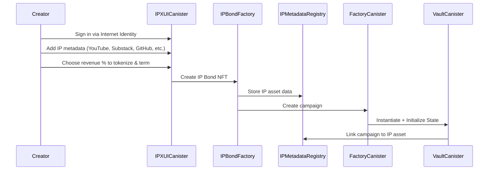
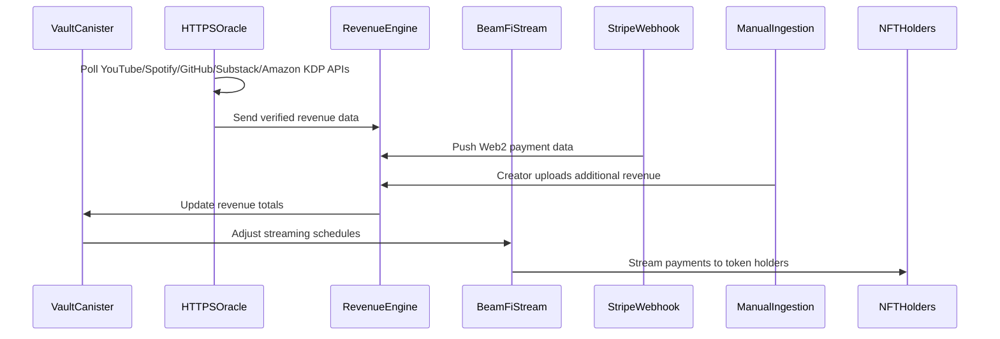

# IPX Protocol Documentation

## Table of Contents
1. [Overview](#overview)
2. [Enhanced Architecture](#enhanced-architecture)
3. [Protocol Mechanics](#protocol-mechanics)
4. [Canister Documentation](#canister-documentation)
5. [Deployment Guide](#deployment-guide)
6. [Integration Guide](#integration-guide)

## Overview

IPX Protocol is a decentralized platform built on the Internet Computer (ICP) that enables creators to tokenize their intellectual property and future revenue streams through NFT-based investment campaigns. The protocol allows creators to raise funding by offering investors specialized IP Bonds (NFTs) that represent a share in their future earnings from platforms like YouTube, Spotify, GitHub, Substack, and Amazon KDP.

### Key Features

- **Intellectual Property Tokenization**: Creators tokenize future revenue streams from multiple platforms through dedicated IP Bond NFTs
- **Multi-Platform Revenue Tracking**: HTTPS outcalls to YouTube, Spotify, GitHub, Substack, Amazon KDP, and traditional payment processors
- **Performance-Linked Payouts**: Dynamic distributions based on actual performance metrics with bonus tiers
- **BeamFi Streaming Integration**: Time-locked payment schedules with real-time adjustments
- **SNS DAO Governance**: Decentralized governance for disputes, platform additions, and protocol decisions
- **Sonic LBP Integration**: Token distribution through Sonic Liquidity Bootstrapping Pools
- **Web2 Payment Integration**: Stripe webhook receiver for traditional revenue sources

## Enhanced Architecture

### Enhanced Modular Canister Architecture

The IPX Protocol implements a sophisticated modular architecture with multiple specialized canisters that work in concert to provide a complete decentralized intellectual property tokenization solution:

```
┌─────────────────────────────────────────────────────────────────────────────┐
│                         IPX Protocol Architecture                           │
├─────────────────────────────────────────────────────────────────────────────┤
│                                                                             │
│  ┌─────────────────┐    ┌─────────────────┐                                │
│  │ User Wallet     │────│ Frontend dApp   │                                │
│  │ (II/Plug)       │    │ (IPX UI)        │                                │
│  └─────────────────┘    └─────────────────┘                                │
│           │                       │                                        │
│           └───────────────────────┼────────────────────────────────────────│
│                                   ↓                                        │
│  ┌─────────────────────────────────────────────────────────────────────┐   │
│  │                    IPX Core Canisters                              │   │
│  │  ┌─────────────────┐  ┌─────────────────┐  ┌─────────────────┐    │   │
│  │  │ IPX UI Canister │  │ IPBond Factory  │  │ IP Metadata     │    │   │
│  │  │ • Frontend      │──│ • Bond NFT      │──│ Registry        │    │   │
│  │  │   Interface     │  │   Creation      │  │ • Asset Data    │    │   │
│  │  │ • User Auth     │  │ • Campaign Mgmt │  │ • Performance   │    │   │
│  │  └─────────────────┘  └─────────────────┘  │   Metrics       │    │   │
│  │           │                     │          └─────────────────┘    │   │
│  │           │      ┌─────────────────┐               │               │   │
│  │           │      │ Revenue         │───────────────┘               │   │
│  │           │      │ Distribution    │                               │   │
│  │           │      │ Engine          │                               │   │
│  │           │      └─────────────────┘                               │   │
│  │           │              │                                         │   │
│  │  ┌─────────────────┐     │      ┌─────────────────┐                │   │
│  │  │ HTTPS Oracle    │─────┘      │ SNS DAO         │                │   │
│  │  │ • YouTube API   │            │ Governance      │                │   │
│  │  │ • Spotify API   │            │ • Proposals     │                │   │
│  │  │ • GitHub API    │            │ • Voting        │                │   │
│  │  │ • Substack API  │            │ • Execution     │                │   │
│  │  │ • Amazon KDP    │            └─────────────────┘                │   │
│  │  └─────────────────┘                                               │   │
│  └─────────────────────────────────────────────────────────────────────┘   │
│                                   │                                        │
│  ┌─────────────────────────────────────────────────────────────────────┐   │
│  │              Treasury & Payment Systems                             │   │
│  │  ┌─────────────────┐  ┌─────────────────┐  ┌─────────────────┐    │   │
│  │  │ BeamFi Streaming│  │ Stripe Webhook  │  │ Manual Revenue  │    │   │
│  │  │ • Time-locked   │  │ Receiver        │  │ Ingestion       │    │   │
│  │  │   payments      │  │ • Web2 Revenue  │  │ Interface       │    │   │
│  │  │ • Vesting       │  │   Integration   │  │ • Creator Input │    │   │
│  │  │ • Claims        │  │ • Real-time     │  │ • Data          │    │   │
│  │  └─────────────────┘  │   Webhooks      │  │   Validation    │    │   │
│  │                       └─────────────────┘  └─────────────────┘    │   │
│  └─────────────────────────────────────────────────────────────────────┘   │
│                                                                             │
│  ┌─────────────────────────────────────────────────────────────────────┐   │
│  │                     External Revenue APIs                           │   │
│  │  YouTube API • Spotify API • GitHub API • Substack API • Amazon KDP │   │
│  └─────────────────────────────────────────────────────────────────────┘   │
└─────────────────────────────────────────────────────────────────────────────┘
```

### Enhanced Protocol Flow

The IPX Protocol enables creators to tokenize their intellectual property through a comprehensive multi-step process:

#### 1. IP Asset Registration & Bond Creation


#### 2. Revenue Tracking & Distribution Lifecycle


## Protocol Mechanics

### 1. IP Asset Registration & Tokenization

When a creator launches an IP tokenization campaign, multiple specialized processes occur:

**IP Asset Registration**: Creator connects multiple revenue-generating platforms:
- **YouTube Channel**: AdSense revenue, subscriber metrics, view analytics
- **Spotify Artist Profile**: Streaming revenue, listener statistics, playlist performance
- **GitHub Repository**: Sponsors income, contribution metrics, repository statistics
- **Substack Publication**: Subscription revenue, reader engagement, growth metrics
- **Amazon KDP Books**: Royalty payments, sales data, reader engagement

**IP Bond NFT Creation**: IPBond Factory creates specialized ICRC-7 compliant NFTs containing:
```json
{
  "ip_asset_id": "12345",
  "bond_type": "multi_platform_creator",
  "platforms": ["youtube", "spotify", "github", "substack", "amazon_kdp"],
  "revenue_share": "25%",
  "term_months": "18",
  "performance_bonuses": [
    {"threshold": 7500, "bonus": "5%"},
    {"threshold": 10000, "bonus": "10%"}
  ],
  "expected_monthly_revenue": "5000",
  "vesting_schedule": "performance_linked",
  "vault_canister": "rdmx6-jaaaa-aaaah-qcaiq-cai"
}
```

### 2. Multi-Source Revenue Tracking

The HTTPS Oracle Canister implements comprehensive revenue tracking across platforms:

**Automated API Integration**:
- **YouTube Data API**: Real-time AdSense revenue, channel analytics, subscriber growth
- **Spotify for Artists API**: Streaming statistics, monthly listeners, revenue data
- **GitHub Sponsors API**: Sponsorship income, repository metrics, contributor statistics
- **Substack Metrics API**: Subscription revenue, post engagement, growth analytics
- **Amazon KDP API**: Book sales, royalty payments, reader engagement metrics

**Web2 Payment Integration**:
- **Stripe Webhook Receiver**: Captures traditional payment processor revenue
- **PayPal Integration**: Additional payment gateway support
- **Manual Revenue Interface**: Creator-submitted revenue from non-API sources

### 3. Performance-Linked Distribution

The Revenue Distribution Engine implements sophisticated payout logic:

**Dynamic Calculations**: Revenue distributions adjust based on actual vs. projected performance
**Performance Bonuses**: Additional rewards for exceeding performance thresholds
**Risk Adjustments**: Reduced distributions during underperformance periods
**Multi-Token Support**: Handles various revenue currencies with automatic conversions

### Enhanced Data Flow & Inter-Canister Communication

The protocol implements sophisticated data flow patterns across multiple canisters and external systems:

1. **IP Asset Registration Flow**: 
   - User → IPX UI → IP Metadata Registry → IPBond Factory → Campaign creation
2. **Multi-Source Revenue Tracking**: 
   - External APIs → HTTPS Oracle → Revenue Distribution Engine → Performance updates
   - Stripe Webhooks → Revenue Distribution Engine → Real-time payments
   - Manual Input → Revenue Distribution Engine → Creator-submitted data
3. **Enhanced Distribution Flow**: 
   - Revenue Engine → Vault Canister → BeamFi Stream → Performance-linked payouts
4. **Governance Integration**: 
   - IP Bond holders → SNS DAO → Multi-canister protocol modifications
5. **Treasury Management**: 
   - Multiple revenue sources → Treasury system → Automated token conversions → Investor payouts

### Complete Protocol Workflow

#### Phase 1: IP Asset Onboarding
1. **Identity Verification**: Creator signs in via Internet Identity
2. **Asset Registration**: Creator adds comprehensive metadata:
   - YouTube Channel ID and AdSense connection
   - Spotify Artist profile and revenue access
   - GitHub repository and Sponsors integration
   - Substack publication and subscriber metrics
   - Amazon KDP author account and book sales data
3. **Tokenization Configuration**: Creator specifies:
   - Percentage of revenue to tokenize (e.g., 20% of next 12 months)
   - Vesting schedule and unlock conditions
   - Performance milestones and bonus distributions
4. **IP Bond Creation**: IPBond Factory mints specialized ICRC-7 NFT representing future revenue rights

#### Phase 2: Token Distribution via Sonic LBP
1. **Liquidity Pool Setup**: IP Bond NFT (or fungible derivatives) listed in Sonic LBP pool
2. **Price Discovery**: Market determines fair value based on historical performance and projections
3. **Investor Participation**: Community purchases IP tokens representing revenue share rights
4. **Ownership Recording**: NFT Registry maintains comprehensive ownership records

#### Phase 3: Multi-Source Revenue Tracking
1. **Automated Data Collection**:
   - YouTube API: AdSense revenue, view metrics, subscriber growth
   - Spotify API: Streaming revenue, monthly listeners, playlist performance
   - GitHub API: Sponsors income, repository statistics, contribution metrics
   - Substack API: Subscription revenue, post engagement, growth metrics
   - Amazon KDP API: Book sales, royalty payments, reader engagement
2. **Web2 Integration**: Stripe webhooks capture traditional payment processor revenue
3. **Manual Supplementation**: Creators can input additional revenue sources via validation interface
4. **Performance Correlation**: Revenue Distribution Engine correlates earnings with performance metrics

#### Phase 4: Performance-Linked Distribution
1. **Dynamic Calculation**: Revenue share adjustments based on actual vs. projected performance
2. **BeamFi Streaming**: Real-time revenue distribution to IP Bond holders
3. **Vesting Management**: Time-locked payments with performance-based unlock acceleration
4. **Claim Processing**: Investors can claim vested amounts through automated interface

#### Phase 5: Community Governance
1. **Proposal System**: IP Bond holders can propose protocol improvements
2. **Weighted Voting**: Voting power proportional to IP token ownership
3. **Automatic Execution**: Approved proposals modify canister behavior via SNS integration
4. **Dispute Resolution**: Community-driven resolution of performance or payout disputes

## Canister Documentation

### Detailed Canister Responsibilities

#### **IPX UI Canister**
- **Frontend Interface**: Serves the main user interface for creators and investors
- **Authentication**: Handles Internet Identity and Plug Wallet integration
- **User Experience**: Provides intuitive workflows for IP asset registration and investment
- **Real-time Updates**: Displays live revenue tracking and payout information

#### **IPBond Factory Canister**
- **IP Bond NFT Creation**: Mints specialized ICRC-7 NFTs representing rights to future IP revenue
- **Campaign Management**: Coordinates with Campaign Factory for campaign instantiation
- **Performance Verification**: Links NFTs to verified performance metrics via HTTPS outcalls
- **Token Sale Integration**: Interfaces with Sonic LBP pools for IP token distribution

#### **IP Metadata Registry Canister**
- **Asset Data Storage**: Centralized registry for all IP asset metadata and performance metrics
- **Multi-Platform Integration**: Stores connections to YouTube channels, Substack publications, GitHub repositories, Amazon KDP books, etc.
- **Performance Tracking**: Maintains historical performance data for trend analysis
- **Verification System**: Validates ownership claims for IP assets

#### **Revenue Distribution Engine Canister**
- **Multi-Source Aggregation**: Processes revenue data from HTTPS oracles, Stripe webhooks, and manual inputs
- **Waterfall Logic**: Implements smart contract payout waterfall calculations
- **Real-time Processing**: Instantly updates distributions when new revenue data arrives
- **Performance-Linked Payouts**: Adjusts distributions based on actual performance metrics

#### **Enhanced HTTPS Oracle Canister**
- **Expanded API Coverage**: 
  - **YouTube Data API**: AdSense revenue, subscriber growth, view metrics
  - **Spotify for Artists**: Monthly listeners, streaming revenue, playlist adds
  - **GitHub Sponsors API**: Sponsorship income, repository statistics
  - **Substack Metrics**: Subscriber count, paid subscriptions, post engagement
  - **Amazon KDP API**: Book sales, royalty payments, reader engagement
- **Data Normalization**: Converts different API formats to standardized revenue schema
- **Anomaly Detection**: Identifies unusual revenue patterns for verification
- **Multi-Platform Correlation**: Cross-references data across platforms for accuracy

#### **BeamFi Stream Canister (Enhanced)**
- **Dynamic Stream Adjustment**: Real-time recalculation based on performance-linked revenue
- **Flexible Vesting**: Supports custom vesting schedules tied to performance milestones
- **Governance Integration**: Allows DAO-approved early unlocks and schedule modifications
- **Multi-Token Support**: Handles various revenue currencies and automatic conversions

#### **Campaign Factory Canister**
- Spawns new Vault Canisters for each IP asset campaign using `create_canister` API
- Maintains global registry of all campaigns for discovery
- Links campaigns to IP assets through metadata registry
- Provides factory methods for scalable campaign creation

#### **Vault Canister (Core Protocol Logic)**
- **NFT Coordination**: Works with IPBond Factory for investment token creation
- **Oracle Integration**: Receives and validates revenue updates from multiple sources
- **Revenue Share Management**: Tracks investor allocations and calculates distributions
- **Stream Coordination**: Instructs BeamFi Stream Canister for payout scheduling
- **State Management**: Maintains campaign funding progress and investor information

#### **NFT Registry Canister (ICRC-7 Compliance)**
- Full ICRC-7 standard implementation for interoperability
- Stores comprehensive metadata including IP asset details and performance data
- Handles transfers, approvals, and ownership queries
- Maintains collection-level statistics and metadata

#### **Treasury & Payment Integration**

##### **Stripe Webhook Receiver Canister**
- **Web2 Revenue Integration**: Seamlessly captures revenue from traditional payment processors
- **Real-time Webhooks**: Processes Stripe payments instantly as they occur
- **Data Verification**: Validates webhook authenticity and prevents duplicate processing
- **Currency Normalization**: Converts fiat payments to protocol tokens for distribution

##### **Manual Revenue Ingestion Interface**
- **Creator Input Portal**: Allows creators to manually input revenue from sources without APIs
- **Data Validation**: Implements verification mechanisms for manually entered data
- **Audit Trail**: Maintains complete records of all manual revenue entries
- **Multi-Format Support**: Accepts various file formats (CSV, JSON, direct input)

#### **Enhanced Governance via SNS DAO Canister**
The governance system now supports expanded decision-making capabilities:

- **IP Asset Whitelisting**: Community votes on approving new types of intellectual property
- **Oracle API Management**: Decisions on adding, modifying, or removing revenue data sources
- **Performance Dispute Resolution**: Handling disagreements about revenue reporting accuracy
- **Bond Term Modifications**: Adjusting revenue share percentages and vesting schedules
- **Protocol Fee Management**: Setting and adjusting fees for different IP asset types
- **Emergency Controls**: Rapid response mechanisms for critical protocol issues

## Deployment Guide

### Prerequisites

1. **DFX SDK**: Install the latest version
```bash
sh -ci "$(curl -fsSL https://internetcomputer.org/install.sh)"
```

2. **Rust**: Install with wasm32 target
```bash
rustup target add wasm32-unknown-unknown
```

3. **Vessel**: For dependency management (if using Motoko)
```bash
cargo install vessel
```

### Setup Project

1. **Clone and setup directory structure**:
```bash
mkdir ipx-protocol && cd ipx-protocol
# Create the directory structure as shown earlier
```

2. **Configure dfx.json**:
```json
{
  "version": 1,
  "canisters": {
    "ipx_ui": {
      "type": "rust",
      "package": "ipx_ui"
    },
    "ipbond_factory": {
      "type": "rust",
      "package": "ipbond_factory"
    },
    "ip_metadata_registry": {
      "type": "rust",
      "package": "ip_metadata_registry"
    },
    "revenue_distribution_engine": {
      "type": "rust",
      "package": "revenue_distribution_engine"
    },
    "https_oracle": {
      "type": "rust",
      "package": "https_oracle"
    },
    "beamfi_stream": {
      "type": "rust",
      "package": "beamfi_stream"
    },
    "campaign_factory": {
      "type": "rust",
      "package": "campaign_factory"
    },
    "vault": {
      "type": "rust", 
      "package": "vault"
    },
    "nft_registry": {
      "type": "rust",
      "package": "nft_registry"
    },
    "stripe_webhook_receiver": {
      "type": "rust",
      "package": "stripe_webhook_receiver"
    },
    "manual_revenue_ingestion": {
      "type": "rust",
      "package": "manual_revenue_ingestion"
    },
    "sns_dao": {
      "type": "rust",
      "package": "sns_dao"
    }
  }
}
```

3. **Build and deploy**:
```bash
# Start local replica
dfx start --background --clean

# Build all canisters
dfx build

# Deploy all canisters
dfx deploy

# Or deploy individually
dfx deploy ipx_ui
dfx deploy ipbond_factory
dfx deploy ip_metadata_registry
# ... etc
```

### Production Deployment

1. **Configure for mainnet**:
```bash
dfx deploy --network ic --with-cycles 1000000000000
```

2. **Set up canister controllers**:
```bash
dfx canister --network ic update-settings ipbond_factory --add-controller <DAO_PRINCIPAL>
dfx canister --network ic update-settings revenue_distribution_engine --add-controller <DAO_PRINCIPAL>
```

3. **Initialize canister relationships**:
```bash
# Set factory canister ID in registry
dfx canister call ip_metadata_registry set_factory_canister '("'$(dfx canister id ipbond_factory)'")'

# Configure oracle endpoints
dfx canister call https_oracle configure_endpoints '(vec {
  record { platform = "youtube"; endpoint = "https://www.googleapis.com/youtube/v3/channels"; };
  record { platform = "spotify"; endpoint = "https://api.spotify.com/v1/artists"; };
  record { platform = "github"; endpoint = "https://api.github.com/users"; };
  record { platform = "substack"; endpoint = "https://api.substack.com/user"; };
  record { platform = "amazon_kdp"; endpoint = "https://kdp.amazon.com/api/author"; };
})'
```

## Integration Guide

### Frontend Integration

1. **Install dependencies**:
```bash
npm install @dfinity/agent @dfinity/candid @dfinity/principal @dfinity/auth-client
```

2. **Create agent and actors**:
```javascript
import { Actor, HttpAgent } from '@dfinity/agent';
import { AuthClient } from '@dfinity/auth-client';
import { idlFactory as ipxUIIdl } from './declarations/ipx_ui';
import { idlFactory as ipbondFactoryIdl } from './declarations/ipbond_factory';

const agent = new HttpAgent({ 
  host: process.env.NODE_ENV === 'production' ? 'https://ic0.app' : 'http://localhost:8000'
});

// In development, fetch root key
if (process.env.NODE_ENV !== 'production') {
  agent.fetchRootKey();
}

const ipxUI = Actor.createActor(ipxUIIdl, {
  agent,
  canisterId: process.env.REACT_APP_IPX_UI_CANISTER_ID
});

const ipbondFactory = Actor.createActor(ipbondFactoryIdl, {
  agent,
  canisterId: process.env.REACT_APP_IPBOND_FACTORY_CANISTER_ID
});
```

3. **Register IP Asset**:
```javascript
// Register multi-platform IP asset
const registerIPAsset = async (creatorData) => {
  try {
    const registration = await ipxUI.register_ip_asset({
      creator_identity: creatorData.principal,
      asset_type: { MultiPlatformCreator: null },
      platforms: [
        {
          platform: "youtube",
          channel_id: creatorData.youtubeChannelId,
          api_credentials: creatorData.youtubeToken,
          revenue_sharing_enabled: true
        },
        {
          platform: "spotify",
          artist_id: creatorData.spotifyArtistId,
          api_credentials: creatorData.spotifyToken,
          revenue_sharing_enabled: true
        },
        {
          platform: "github",
          username: creatorData.githubUsername,
          repositories: creatorData.repositories,
          sponsors_enabled: true
        }
      ],
      tokenization_config: {
        revenue_percentage: creatorData.revenuePercentage,
        term_months: creatorData.termMonths,
        vesting_schedule: { PerformanceLinked: null }
      }
    });
    
    console.log('IP Asset registered:', registration);
    return registration;
  } catch (error) {
    console.error('Registration failed:', error);
    throw error;
  }
};
```

### Wallet Integration

1. **Internet Identity Authentication**:
```javascript
import { AuthClient } from '@dfinity/auth-client';

class AuthService {
  constructor() {
    this.authClient = null;
    this.identity = null;
  }

  async init() {
    this.authClient = await AuthClient.create();
    this.identity = this.authClient.getIdentity();
  }

  async login() {
    return new Promise((resolve, reject) => {
      this.authClient.login({
        identityProvider: process.env.NODE_ENV === 'production' 
          ? 'https://identity.ic0.app'
          : `http://localhost:4943?canisterId=${process.env.INTERNET_IDENTITY_CANISTER_ID}`,
        onSuccess: () => {
          this.identity = this.authClient.getIdentity();
          resolve(this.identity);
        },
        onError: reject
      });
    });
  }

  async logout() {
    await this.authClient.logout();
    this.identity = null;
  }

  isAuthenticated() {
    return this.authClient?.isAuthenticated() || false;
  }

  getIdentity() {
    return this.identity;
  }

  getPrincipal() {
    return this.identity?.getPrincipal();
  }
}

export const authService = new AuthService();
```

2. **Plug Wallet Integration**:
```javascript
class PlugWalletService {
  async connect() {
    try {
      const plugConnected = await window.ic.plug.requestConnect({
        whitelist: [
          process.env.REACT_APP_IPX_UI_CANISTER_ID,
          process.env.REACT_APP_IPBOND_FACTORY_CANISTER_ID,
          process.env.REACT_APP_NFT_REGISTRY_CANISTER_ID
        ],
        host: process.env.NODE_ENV === 'production' ? 'https://ic0.app' : 'http://localhost:8000'
      });

      if (plugConnected) {
        this.principal = await window.ic.plug.getPrincipal();
        return true;
      }
      return false;
    } catch (error) {
      console.error('Plug wallet connection failed:', error);
      return false;
    }
  }

  async createActor(canisterId, idlFactory) {
    return await window.ic.plug.createActor({
      canisterId,
      interfaceFactory: idlFactory
    });
  }

  isConnected() {
    return window.ic?.plug?.isConnected() || false;
  }

  getPrincipal() {
    return this.principal;
  }
}

export const plugWalletService = new PlugWalletService();
```

### Oracle Integration & Revenue Tracking

1. **Configure Multi-Platform Monitoring**:
```javascript
const setupRevenueTracking = async (ipAssetId, platformConfigs) => {
  try {
    const httpsOracle = Actor.createActor(httpsOracleIdl, {
      agent,
      canisterId: process.env.REACT_APP_HTTPS_ORACLE_CANISTER_ID
    });

    const config = await httpsOracle.configure_multi_platform_monitoring(
      ipAssetId,
      {
        youtube: {
          channel_id: platformConfigs.youtube.channelId,
          metrics: ["revenue", "views", "subscribers", "watch_time"],
          update_frequency: { hours: 6 },
          adsense_integration: true
        },
        spotify: {
          artist_id: platformConfigs.spotify.artistId,
          metrics: ["monthly_listeners", "streams", "revenue"],
          update_frequency: { hours: 12 },
          for_artists_api: true
        },
        github: {
          username: platformConfigs.github.username,
          repositories: platformConfigs.github.repositories,
          metrics: ["sponsors_revenue", "stars", "forks", "commits"],
          update_frequency: { hours: 24 }
        },
        substack: {
          publication_url: platformConfigs.substack.publicationUrl,
          metrics: ["subscriber_count", "paid_subscribers", "post_views", "revenue"],
          update_frequency: { hours: 8 }
        },
        amazon_kdp: {
          author_id: platformConfigs.amazonKDP.authorId,
          books: platformConfigs.amazonKDP.books,
          metrics: ["units_sold", "royalties", "page_reads"],
          update_frequency: { hours: 24 }
        }
      }
    );

    console.log('Multi-platform monitoring configured:', config);
    return config;
  } catch (error) {
    console.error('Oracle configuration failed:', error);
    throw error;
  }
};
```

2. **Real-time Revenue Updates**:
```javascript
const subscribeToRevenueUpdates = (ipAssetId, callback) => {
  const pollInterval = setInterval(async () => {
    try {
      const revenueEngine = Actor.createActor(revenueEngineIdl, {
        agent,
        canisterId: process.env.REACT_APP_REVENUE_ENGINE_CANISTER_ID
      });

      const revenueData = await revenueEngine.get_latest_revenue_data(ipAssetId);
      
      if (revenueData) {
        callback({
          totalRevenue: revenueData.total_revenue,
          platformBreakdown: revenueData.platform_breakdown,
          performanceMetrics: revenueData.performance_metrics,
          lastUpdated: revenueData.last_updated
        });
      }
    } catch (error) {
      console.error('Failed to fetch revenue updates:', error);
    }
  }, 30000); // Poll every 30 seconds

  return () => clearInterval(pollInterval);
};
```

### Investment Flow Integration

1. **Investment Interface**:
```javascript
const investInIPBond = async (bondId, investmentAmount, slippageTolerance = 2.0) => {
  try {
    // First, get bond details for analysis
    const ipbondFactory = Actor.createActor(ipbondFactoryIdl, {
      agent,
      canisterId: process.env.REACT_APP_IPBOND_FACTORY_CANISTER_ID
    });

    const bondDetails = await ipbondFactory.get_bond_details(bondId);
    
    // Calculate expected returns
    const roiProjection = await calculateROIProjection(
      investmentAmount,
      bondDetails.performance_analysis,
      bondDetails.term_months
    );

    console.log(`Expected ROI over ${bondDetails.term_months} months: ${roiProjection.annualized_return}%`);

    // Make investment through Sonic LBP
    const sonicLBP = Actor.createActor(sonicLBPIdl, {
      agent,
      canisterId: process.env.REACT_APP_SONIC_LBP_CANISTER_ID
    });

    const investmentResult = await sonicLBP.invest_in_ip_bond({
      bond_id: bondId,
      investment_amount: investmentAmount,
      investor_principal: authService.getPrincipal(),
      slippage_tolerance: slippageTolerance
    });

    console.log('Investment successful:', investmentResult);
    return investmentResult;
  } catch (error) {
    console.error('Investment failed:', error);
    throw error;
  }
};
```

2. **Stream Management**:
```javascript
const manageInvestmentStreams = async (investorPrincipal) => {
  try {
    const beamfiStream = Actor.createActor(beamfiStreamIdl, {
      agent,
      canisterId: process.env.REACT_APP_BEAMFI_STREAM_CANISTER_ID
    });

    // Get all streams for investor
    const streams = await beamfiStream.get_investor_streams(investorPrincipal);
    
    const streamData = await Promise.all(
      streams.map(async (streamId) => {
        const details = await beamfiStream.get_stream_details(streamId);
        const claimableAmount = await beamfiStream.get_claimable_amount(streamId);
        
        return {
          streamId,
          details,
          claimableAmount,
          canClaim: claimableAmount > 0
        };
      })
    );

    return streamData;
  } catch (error) {
    console.error('Failed to fetch stream data:', error);
    throw error;
  }
};

const claimStreamPayments = async (streamId, includePerformanceBonus = true) => {
  try {
    const beamfiStream = Actor.createActor(beamfiStreamIdl, {
      agent,
      canisterId: process.env.REACT_APP_BEAMFI_STREAM_CANISTER_ID
    });

    const claimResult = await beamfiStream.claim_with_bonus(
      streamId,
      includePerformanceBonus
    );

    console.log('Claim successful:', claimResult);
    return claimResult;
  } catch (error) {
    console.error('Claim failed:', error);
    throw error;
  }
};
```

## Security Considerations

### Access Control
- Only authorized vault canisters can mint IP Bond NFTs
- Only verified oracle canisters can update revenue data
- Only campaign creators can modify specific campaign settings
- DAO governance required for critical protocol changes
- Multi-signature requirements for high-value operations

### Input Validation
- All user inputs are validated and sanitized at canister level
- Revenue share percentages are capped at 100%
- Investment amounts are checked against funding goals and limits
- Oracle data undergoes verification before processing
- API credentials are encrypted and stored securely

### Upgradability
- All canisters support stable storage for seamless upgrades
- Critical state is preserved across upgrades using pre/post upgrade hooks
- Upgrade proposals go through DAO governance process
- Backward compatibility maintained for existing investments

### Economic Security
- Revenue distributions are calculated deterministically
- All transactions are recorded immutably on-chain
- NFT ownership provides cryptographic proof of investment rights
- Streaming prevents manipulation of payout timing
- Performance bonuses are calculated transparently

## Troubleshooting

### Common Issues

1. **Canister out of cycles**:
```bash
dfx canister status ipbond_factory
dfx ledger top-up ipbond_factory --amount 1.0
```

2. **Wasm module too large**:
```bash
# Optimize build
cargo build --target wasm32-unknown-unknown --release --profile release
ic-wasm target/wasm32-unknown-unknown/release/vault.wasm -o vault_optimized.wasm shrink
```

3. **Inter-canister call failures**:
- Check canister IDs are correct in environment variables
- Verify network connectivity and replica status
- Ensure sufficient cycles for cross-canister calls
- Validate canister permissions and access controls

4. **Oracle API failures**:
- Verify API credentials are valid and not expired
- Check rate limits haven't been exceeded
- Ensure external APIs are accessible from IC
- Validate response parsing logic

### Monitoring and Logging

1. **View canister logs**:
```bash
dfx canister logs ipbond_factory
dfx canister logs revenue_distribution_engine
```

2. **Monitor metrics with custom logging**:
```rust
ic_cdk::println!("IP Bond {} created for asset {} with vault {}", 
                bond_id, asset_id, vault_id);
ic_cdk::println!("Revenue update: ${} from {} platform", 
                revenue_amount, platform_name);
```

3. **Performance monitoring**:
```javascript
// Frontend performance tracking
const trackIPAssetPerformance = async (assetId) => {
  const startTime = performance.now();
  
  try {
    const performanceData = await ipMetadataRegistry.get_performance_analysis(assetId);
    const endTime = performance.now();
    
    console.log(`Performance data fetched in ${endTime - startTime}ms`);
    return performanceData;
  } catch (error) {
    console.error('Performance tracking failed:', error);
  }
};
```

## Contributing

### Development Setup
1. Fork the repository from GitHub
2. Create feature branch: `git checkout -b feature/new-platform-integration`
3. Add comprehensive tests for new functionality
4. Submit pull request with detailed description and testing results

### Testing Strategy
```bash
# Run unit tests
cargo test --all

# Run integration tests
dfx test --all

# Run specific canister tests
cargo test --package ipbond_factory
dfx test ipbond_factory
```

### Code Standards
- Follow Rust naming conventions and best practices
- Add comprehensive documentation for public APIs
- Include proper error handling for all operations
- Use stable storage patterns for persistent data
- Implement proper access control and validation
- Add performance considerations for large-scale operations

---

This comprehensive documentation provides everything needed to understand, deploy, and integrate with the IPX Protocol. For additional support, please refer to the Internet Computer documentation or open an issue in the project repository.